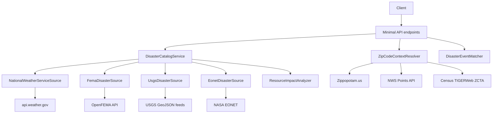

# Disaster Tracker API Architecture

## Purpose

This service aggregates free public disaster feeds into one normalized API so clients can answer:

- what is happening right now
- whether a specific ZIP code is impacted
- when an event may be over
- whether a strategic supply region may be affected

## Architectural style

The application is a single ASP.NET Core minimal API service with a small set of focused layers:

- endpoint layer for HTTP routing and query binding
- source adapter layer for external-feed normalization
- service layer for orchestration, spatial matching, and impact analysis
- domain layer for normalized models
- support layer for JSON and geospatial helpers

It favors simple in-process composition over heavy framework structure so new feeds and matching rules can be added quickly.

## High-level component view



## Repository structure

```text
src/DisasterTracker.Api/
  Configuration/         Options bound from appsettings
  Domain/                Canonical models and query/response types
  Endpoints/             HTTP route mappings
  Services/              Orchestration and business logic
  Sources/               External source adapters
  Support/               Shared JSON, geo, and helper utilities
  Data/                  Static strategic resource profiles

tests/DisasterTracker.Api.Tests/
  Source mapping tests
  Matching tests
  Catalog and analyzer tests
  ZIP resolver tests
```

## Core runtime flow

### 1. Snapshot creation

`DisasterCatalogService` is the central orchestrator.

It:

- refreshes all registered `IDisasterSourceClient` implementations
- merges their normalized events into one ordered snapshot
- computes source health from refresh results
- computes resource-impact signals from the active event set
- attaches matching impact signals back onto each event
- caches the snapshot for a configured duration

The service is protected by a refresh lock so concurrent requests do not stampede external APIs.

### 2. Background refresh

`DisasterRefreshWorker` warms and refreshes the in-memory snapshot on a schedule. This keeps request latency lower and reduces repeated calls to public APIs.

### 3. HTTP request handling

`ApiEndpointMappings` exposes the API surface:

- `/api/disasters/active`
- `/api/disasters/zip/{zipCode}`
- `/api/disasters/{id}`
- `/api/impacts/resources`
- `/api/sources/health`

Endpoints are intentionally thin. They delegate most behavior to services and return normalized response models from `Domain/OperationalModels.cs`.

## Canonical domain model

The core domain object is `DisasterEvent`.

Important fields include:

- identity: `Id`, `Source`, `SourceEventId`
- classification: `Category`, `Severity`, `Status`
- timing: `StartedAt`, `EndedAt`, `ExpectedEndAt`, `EndTimeConfidence`, `EndTimeExplanation`
- geography: `StateCodes`, `CountyFipsCodes`, `ZoneIds`, `Centroid`, `RadiusKm`
- geometry: `FootprintPolygons`
- context: `Summary`, `Description`, `Instruction`, `SourceUrl`
- enrichment: `ImpactedResources`

This model lets the rest of the system work with one consistent event shape even though each source publishes different payloads.

## Source adapter layer

Each feed implements `IDisasterSourceClient`.

### National Weather Service

`NationalWeatherServiceSource` fetches active alerts from `api.weather.gov` and maps:

- NWS identifiers
- event type and severity
- active time windows
- zone and county coverage
- published alert polygons when available

### FEMA

`FemaDisasterSource` maps FEMA declarations into county-based disaster records. It is stronger as a declaration and situational context source than as a minute-by-minute incident feed.

### USGS

`UsgsDisasterSource` maps recent earthquakes into normalized monitoring events. The quake itself is instantaneous, but operational effects can still matter after the event.

### EONET

`EonetDisasterSource` adds global coverage. It preserves polygon footprints when available and otherwise derives a centroid and estimated radius from published geometry and magnitude metadata.

## ZIP impact flow

The ZIP-impact path is a composition of three services:

### `ZipCodeContextResolver`

This service resolves:

- ZIP centroid and locality from Zippopotam.us
- NWS forecast zone, fire weather zone, and county from `api.weather.gov/points`
- Census ZCTA polygon boundaries from TIGERWeb

If boundary lookup fails, the service degrades gracefully to centroid-only behavior.

### `DisasterEventMatcher`

This service determines whether a ZIP is impacted by an event. Matching rules vary by source:

- NWS: polygon intersection first, then zone match, then county match
- FEMA: county match
- USGS and EONET: polygon intersection first when present, then centroid/radius intersection against the ZIP boundary, then centroid distance

Each match returns a confidence level and a human-readable reason.

### Geo support

`Support/GeoMath.cs` and `Support/GeoJsonGeometryParser.cs` provide:

- Haversine distance
- polygon parsing from GeoJSON
- point-in-polygon checks
- polygon intersection checks
- circle-to-polygon intersection checks

## Resource-impact analysis

`ResourceImpactAnalyzer` loads strategic region profiles from `Data/strategic-resource-profiles.json`.

Profiles can match on:

- state codes
- county FIPS codes
- disaster categories
- minimum severity
- minimum magnitude
- geographic bounding boxes
- location keywords in event text

This allows the current build to support both U.S. and first-pass global supply signals.

The output model is `ResourceImpactSignal`, which is intentionally explainable rather than predictive.

## Configuration model

Options are defined in `Configuration/ServiceOptions.cs` and bound from `appsettings.json`.

The main configuration groups are:

- refresh and cache behavior
- per-source base URLs and timeouts
- ZIP lookup and ZIP boundary behavior
- strategic resource profile location

This keeps adapters and services configurable without hard-coding provider-specific settings.

## Operational behavior

The service includes:

- in-memory snapshot caching
- scheduled background refresh
- per-source health reporting
- standard ASP.NET Core problem details
- OpenAPI in development

Health is exposed at:

- `/health` for overall service status
- `/api/sources/health` for per-source freshness and failures

## Testing strategy

The test suite covers:

- source normalization for NWS, FEMA, USGS, and EONET
- ZIP/event matching behavior
- ZIP boundary resolution
- resource-impact analysis
- catalog aggregation and source health behavior

Tests live in `tests/DisasterTracker.Api.Tests`.

## Extension points

The design is set up so future work can plug in cleanly:

- add another external feed by implementing `IDisasterSourceClient`
- add richer geography by extending geo helpers and source footprint mapping
- add more strategic supply overlays by extending the JSON profile catalog
- add persistence or historical analytics behind `DisasterCatalogService` if the product moves beyond current-state snapshots

## Current trade-offs

- the service prefers explainability over predictive complexity
- public feeds vary in geometry quality and end-time precision
- in-memory caching keeps the app simple, but it does not yet provide historical storage
